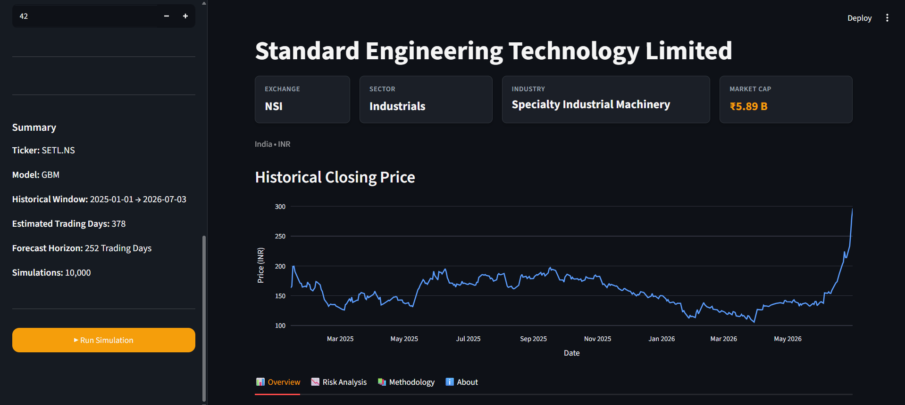
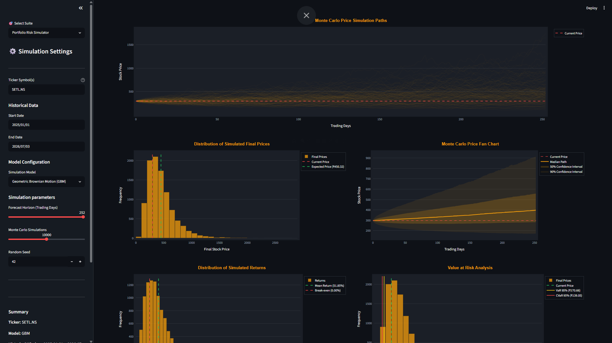
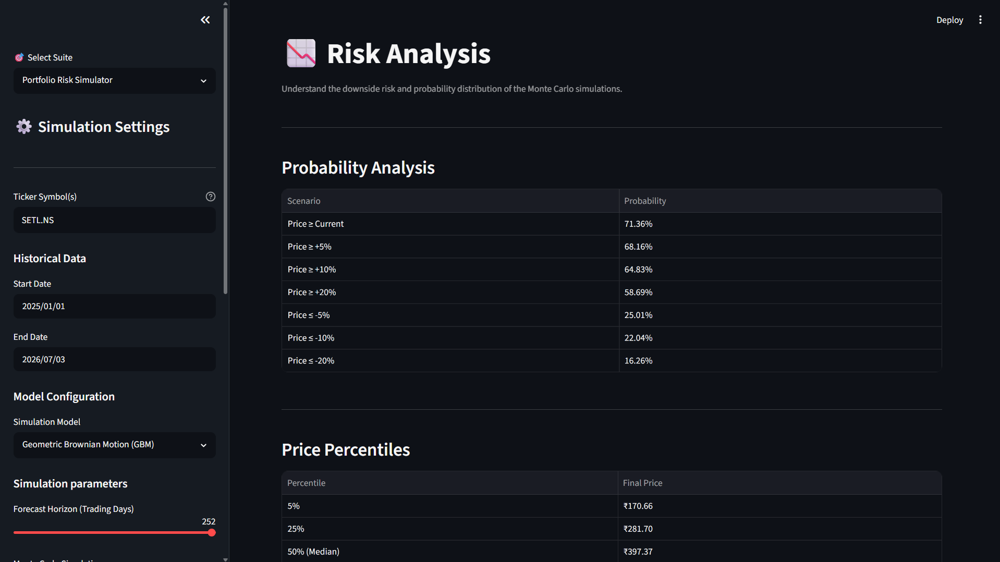
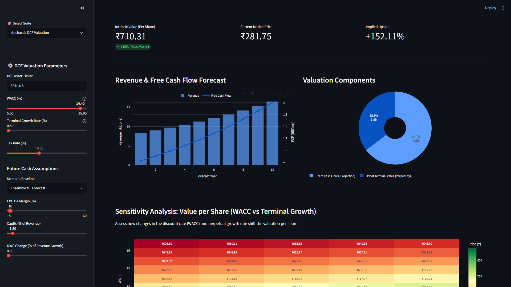
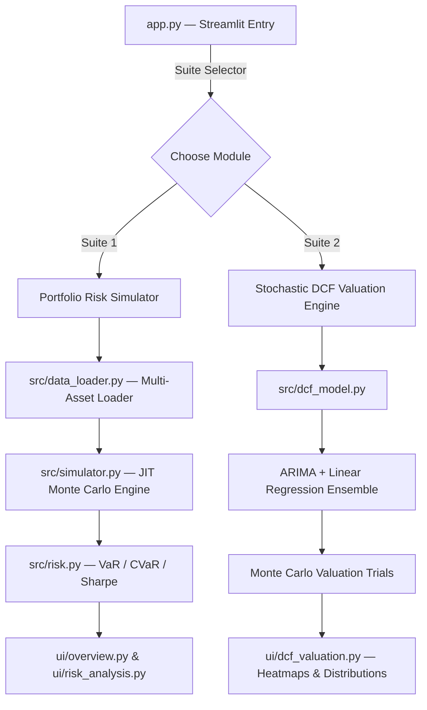

# 📈 Stochastic Finance & Valuation Platform

[](https://share.streamlit.io/) <!-- Replace with your live Streamlit URL -->
[](https://github.com/your-username/stochastic-finance-hub/actions)
[](LICENSE)
[](https://www.python.org/)

An enterprise-grade, high-performance quantitative finance platform containing two primary analysis suites:

1. **Equity Portfolio Risk Simulator** — Multivariate Monte Carlo simulations on single equities or correlated multi-asset portfolios using Numba JIT acceleration and three stochastic diffusion models.
2. **Stochastic DCF Valuation Engine** — Computes intrinsic value ranges using ARIMA/Linear Regression ensemble forecasting combined with Monte Carlo parameter sampling across WACC, growth, and margin assumptions.

---

## 🖼️ Screenshots

### Portfolio Risk Simulator — Historical Price & Company Cards


### Monte Carlo Simulation Paths (10,000 Trials)


### Downside Risk Analysis — Probability Table


### ML-Powered Stochastic DCF Valuation — Sensitivity Heatmap


---

## 🛠️ Architecture



---

## ✨ Features

### Suite 1 — Equity Portfolio Risk Simulator
- **Multi-Asset Portfolios**: Comma-separated tickers with user-defined weights, Cholesky-decomposed covariance for correlation modeling.
- **Three Stochastic Models**:
  - **GBM** — Geometric Brownian Motion (standard lognormal drift)
  - **MJD** — Merton Jump Diffusion (Poisson jump process for crash events)
  - **Bootstrap** — Aligned historical return resampling (preserves empirical joint distribution)
- **Numba JIT `@njit`** — Nested simulation loops compiled to machine code (up to 50× faster than pure Python)
- **Risk Metrics** — VaR (95%), CVaR (95%), Sharpe Ratio, annualized volatility via $\sqrt{w^T \Sigma w}$

### Suite 2 — Stochastic DCF Valuation Engine
- **ML Revenue Forecasting** — ARIMA(1,1,0) and Linear Regression ensemble for baseline revenue trajectory
- **10-Year DCF Model** — NOPAT → FCF → Discounted PV → Terminal Value → Per-Share Intrinsic Value
- **Sensitivity Heatmap** — 2D Plotly heatmap: value-per-share across WACC × Terminal Growth Rate ranges
- **Monte Carlo Valuation** — Samples WACC, revenue growth, EBITDA margin, and TGR from normal distributions to produce a probability density of intrinsic values
- **Undervaluation Probability** — `P(Intrinsic Value ≥ Market Price)` computed directly from simulation results

---

## 📐 Mathematical Foundations

### Multivariate GBM with Cholesky Decomposition
$$\Sigma = LL^T \quad \Longrightarrow \quad X_t = \vec{\mu} + LZ_t, \quad Z_t \sim \mathcal{N}(0, I_N)$$

### Merton Jump Diffusion
$$dX_{t,a} = \left(\mu_a - \tfrac{1}{2}\sigma_a^2\right)dt + \sum_k L_{a,k}\,dZ_{t,k} + J_t\,dN_t, \quad N_t \sim \text{Poisson}(\lambda)$$

### DCF Free Cash Flow
$$\text{FCF}_t = \text{NOPAT}_t + \text{DA}_t - \text{CapEx}_t - \Delta\text{NWC}_t$$

$$\text{EV} = \sum_{t=1}^{10} \frac{\text{FCF}_t}{(1+r)^t} + \frac{\text{FCF}_{10}(1+g)}{(r-g)(1+r)^{10}}$$

---

## 📂 Directory Layout

```text
stochastic-finance-hub/
├── app.py                       # Multi-suite Streamlit entry point
├── Makefile                     # Developer shortcuts (run, test, lint)
├── requirements.txt             # All Python dependencies
├── LICENSE                      # MIT License
├── .github/workflows/ci.yml     # GitHub Actions CI pipeline
├── src/
│   ├── data_loader.py           # Multi-asset data ingestion & alignment
│   ├── simulator.py             # Numba JIT simulation engine
│   ├── risk.py                  # Portfolio risk & return statistics
│   ├── dcf_model.py             # DCF + ARIMA/LR + Monte Carlo engine
│   ├── visualizations.py        # Plotly chart generators
│   └── utils.py                 # Currency formatting helpers
├── ui/
│   ├── theme.py                 # Premium dark CSS
│   ├── sidebar.py               # Portfolio config panel
│   ├── overview.py              # Summary charts
│   ├── risk_analysis.py         # Downside risk percentiles
│   ├── methodology.py           # Quantitative documentation
│   ├── dcf_valuation.py         # DCF input & results view
│   └── about.py                 # Project disclaimer
├── tests/
│   ├── test_simulation.py       # 7 portfolio simulator tests
│   └── test_dcf.py              # DCF math & mock-based tests
└── docs/screenshots/            # README preview images
```

---

## 🚀 Quick Start

```bash
# 1. Clone
git clone https://github.com/your-username/stochastic-finance-hub.git
cd stochastic-finance-hub

# 2. Create & activate virtual environment
python -m venv venv
venv\Scripts\activate        # Windows
# source venv/bin/activate   # macOS/Linux

# 3. Install dependencies
make install                 # or: pip install -r requirements.txt

# 4. Launch dashboard
make run                     # or: streamlit run app.py
```

---

## 🧪 Running Tests

```bash
make test          # or: python -m pytest -v
```

All **8 tests pass**, covering:
- Single & multi-asset GBM path generation
- Cholesky-correlated portfolio simulation
- Numba JIT vs NumPy numerical equivalence
- Merton Jump Diffusion paths
- Mock-based DCF parsing, ARIMA forecasting, and Monte Carlo valuation

---

## 🌐 Deployment

1. Push to GitHub
2. Sign in to [Streamlit Community Cloud](https://share.streamlit.io/)
3. **New App** → select repo → set main file: `app.py` → Deploy
4. Paste live URL into the badge at the top of this file

---

## ⚠️ Disclaimer

This platform is for **educational and quantitative analysis purposes only**. It does not constitute investment advice or financial recommendations. Past performance is not indicative of future results.
